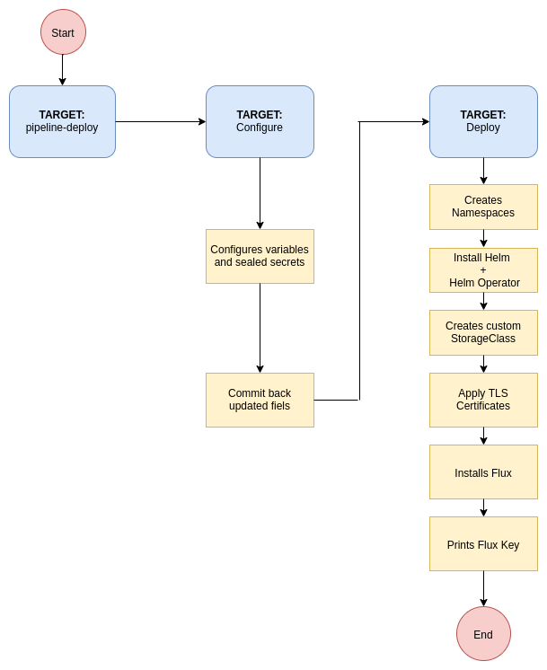

# StakaterPlatform

## Problem Statement

How can a novice user deploy tools that are required for the management of kubernetes cluster?

## Solution

Kick-start your kubernetes cluster with Stakater Platform. A consolidated solution for logging, tracing, monitoring, delivery, security and much more. 
StakaterPlatform gives you a head start for managing your kubernetes cluster by providing open source tools across seven 
stacks so that you are only concerned about developing your applications, StakaterPlatform will take care of the rest.

For detailed walk-through please visit [StakaterPlatform on Playbook](https://playbook.stakater.com/content/stacks/stakaterplatform.html)


StakaterPlatform consist of 7 stacks:

- [Control](https://playbook.stakater.com/content/stacks/control.html)
- [Delivery](https://playbook.stakater.com/content/stacks/delivery.html)
- [Logging](https://playbook.stakater.com/content/stacks/logging.html)
- [Monitoring](https://playbook.stakater.com/content/stacks/monitoring.html)
- [Security](https://playbook.stakater.com/content/stacks/security.html)
- [Alerting](https://playbook.stakater.com/content/stacks/alerting.html)
- [Tracing](https://playbook.stakater.com/content/stacks/tracing.html)


## Prerequisites

- Kubernetes cluster with at least 8 VCPUS & 32 GB of RAM
- A working domain (e.g. `stakaterplatform.com` ) 
- SSL Certificate for that domain. [Creating & using custom SSL certificates](https://playbook.stakater.com/content/processes/exposing/create-use-tls-custom-cert.html)


## Tools

**Flux:** You define the entire desired state of your cluster in git and flux ensures that the current state matches the one declared in repo.

## Install from local machine

### Prerequisites

- kubectl (between v1.11 & v1.15.3)
- helm (v2.15.0 or lower)


1. [Duplicate](https://help.github.com/en/github/creating-cloning-and-archiving-repositories/duplicating-a-repository#mirroring-a-repository) this [repository](https://github.com/stakater/stakaterplatform).
2. Update [configuration variables](#Basic-Configuration) in `variables.config` file and provide the relevant values.
3. [Recommended but optional] To take full advantage of the tool stack configure [Additional Variables](docs/detailed-config.md) as well.
4. Ensure that correct context is set for kubectl & helm.
5. run `make configure`, this will make all required substitutions based on configuration variables in the repository. When prompted commit those changes, don't commit them if you want to run everything from your local machine i.e. No flux hence no GitOps.
6. For deployment there are two options:
    
    a. Using [flux](https://playbook.stakater.com/content/processes/gitops/gitops-with-flux.html), [Add the public SSH key](https://help.github.com/en/github/authenticating-to-github/adding-a-new-ssh-key-to-your-github-account) of flux(configs/flux.pub) to your Git repository with **write access**. 
    
    b. Without flux, just don't add flux key and this will remove the process of GitOps(using flux) from your cluster. It removes the need of having your repository available remotely
7. Run `make deploy` 
    
    a. Using flux, this will deploy flux which will in turn deploy StakaterPlatform via GitOps.
    
    b. If you don't want to use flux, just run `make deploy-without-flux` which will run `kubectl apply -f platform/` and deploy StakaterPlatform.
9. Estimated time for everything to be up and running is 5-10. Use the following command to get token to access kubernetes dashboard at `dashboard-control.YOURDOMAINNAME`:
    ```
    kubectl -n control describe secret $(kubectl -n control get secret | grep stakater-control-dashboard-kubernetes-dashboard-token | awk '{print $1}') | grep 'token:' | awk '{print $2}'
    ```
10. Visit `https://forecastle-control.YOURDOMAINNAME` and you'll be able to view all applications deployed by StakaterPlatform.


**Note:** Since `variables.config` file and `configs/` directory contains private information those files are not being
 tracked in git and won't/shouldn't be committed. In case you want to commit those changes run `make track-secrets`.

## Install via GitLab CI Pipeline

1. [Duplicate](https://help.github.com/en/github/creating-cloning-and-archiving-repositories/duplicating-a-repository#mirroring-a-repository) this [repository](https://github.com/stakater/stakaterplatform) in a GitLab account.
2. Update [configuration variables](#Basic-Configuration) in `variables.config` file and provide the relevant values.
3. Create a [Personal Access Token](https://docs.gitlab.com/ee/user/profile/personal_access_tokens.html#creating-a-personal-access-token) on GitLab and note down Personal Access Token (Available only when created)
4. Configure CI/CD Environment variables in `<Your GitLab Project> -> Settings -> CI/CD`.
5. Add Following variables for the pipeline

| Pipeline Variables | Description |  
|:---|:---|
| KUBE_CONFIG | `Base64 encoded` KubeConfig of the kubernetes cluster you want to deploy on |
| REPO_ACCESS_TOKEN | Personal access token generated in Step 3 |
| TARGET | Make file target. Value: `pipeline-deploy` |
| AWS_ACCESS_KEY_ID | (Define only if `CLOUD_PROVIDER` is `aws`) AWS Access Key Id. |
| AWS_SECRET_ACCESS_KEY | (Define only if `CLOUD_PROVIDER` is `aws`) AWS Secret Access Key. |

6. [Add the public SSH key](https://docs.gitlab.com/ee/ssh/#per-repository-deploy-keys)(Deploy Keys) to your GitLab account with **write access** printed at the end of pipeline logs.
7. Once key is added StakaterPlatform will deploy on your cluster (Estimated time: 5-10 minutes). :confetti_ball: 
8. Access the Kubernetes dashboard at `dashboard-control.DOMAIN`. Token can be get by following command
    ```
    kubectl -n control describe secret $(kubectl -n control get secret | grep stakater-control-dashboard-kubernetes-dashboard-token | awk '{print $1}') | grep 'token:' | awk '{print $2}'
    ```
### Flow Diagram for Deployment via GitLab CI Pipeline

<p align="center">

</p>

## Verification

### Locally
Run `make verify` to run tests to ensure that all the relevant endpoints are up and running.

### GitLab CI
Run pipeline with Pipeline variable: `TARGET` = verify 


## Basic Configuration
| Variables | Description | Default |  
|:---|:---|:---:|
| CLOUD_PROVIDER | Name of the k8s cloud provider | `nil` <br> (`aws` \| `azure`) |
| DNS_PROVIDER | Cloud DNS Provider | `aws` (Route53) |
| EXTERNAL_DNS_AWS_ACCESS_KEY_ID | AWS Access Key Id having access to create/delete/update Route53 HostedZone entries | `nil` |
| EXTERNAL_DNS_AWS_SECRET_ACCESS_KEY | AWS Secret Access Key having access to create/delete/update Route53 HostedZone entries | `nil` |
| DOMAIN | Domain to use for StakaterPlatform | `nil` |
| BASE64_ENCODED_SSL_CERTIFICATE_CA_CRT | Base64 encoded Intermediate Certificate value | `nil` |
| BASE64_ENCODED_SSL_CERTIFICATE_TLS_CRT | Base64 encoded Server Certificate value |`nil` |
| BASE64_ENCODED_SSL_CERTIFICATE_TLS_KEY | Base64 encoded Certificate Key value |`nil` |
| STAKATER_PLATFORM_SSH_GIT_URL | SSH URL for your Github repo. | `nil`<br>(e.g `git@github.com/stakater/StakaterPlatform.git`. Notice `:` is replaced with `/` in the URL ) |
| STAKATER_PLATFORM_BRANCH | Branch to use for `STAKATER_PLATFORM_SSH_GIT_URL` | `master` |


For generating certificates view: [Creating & using custom SSL certificates](https://playbook.stakater.com/content/processes/exposing/create-use-tls-custom-cert.html)


## Detailed Configuration and Stack definitions

See [Detailed Configurations](docs/detailed-config.md) for configuring available tools in the stacks.

See [Stakater Playbook](https://playbook.stakater.com/content/stacks/stakaterplatform.html#overview) for stack definitions and configuration options.

## Uninstall

Run `make destroy` to remove StakaterPlatform from your cluster.

## Production Configuration and Hardening

- Replace all secrets with sealed-secrets. [Stakater Workshop - Sealed Secrets](https://playbook.stakater.com/content/workshop/sealed-secrets/introduction.html) In coming updates for StakaterPlatform this will be followed by default
- Change default usernames and passwords for all tools (`variables.config`)
- Add your own SSH keys for flux
- Use Identity Providers (e.g. Google, Active Directory etc.) and configure keyCloak to use that. [KeyCloak with Identity Providers](https://playbook.stakater.com/content/processes/security/keycloak.html#keycloak-with-identity-providers)
- Use keycloak for SSO over all exposed applications
- Enable mTLS between microservices to prevent unauthorized connections between pods
- Only allow restricted access to users other than the administrator for dashboard
- Don't share your kubeconfig file and other secrets, it's suggested to keep such things in [vault](https://github.com/hashicorp/hands-on-with-vault-on-kubernetes)


## Compatibility Matrix

StakaterPlatform has been tested on following kubernetes flavors:

| Platform Version| K8s Version  | Infrastructure |
|---|---|---|
| v0.0.1 | 1.14 | [](https://aws.amazon.com/eks/) eks.6 |
| v0.0.1 | 1.14.8 | [](https://docs.microsoft.com/en-us/azure/aks/)  aks|


## Community

If you have questions, check the [Documentation](https://playbook.stakater.com/content/stacks/stakaterplatform.html) and
 talk to us on slack [#community on Stakater Slack](https://stakater.slack.com/messages/community).
 
Click [here](https://slack-inviter.stakater.com) to join [Stakater](https://stakater.com) on Slack.
